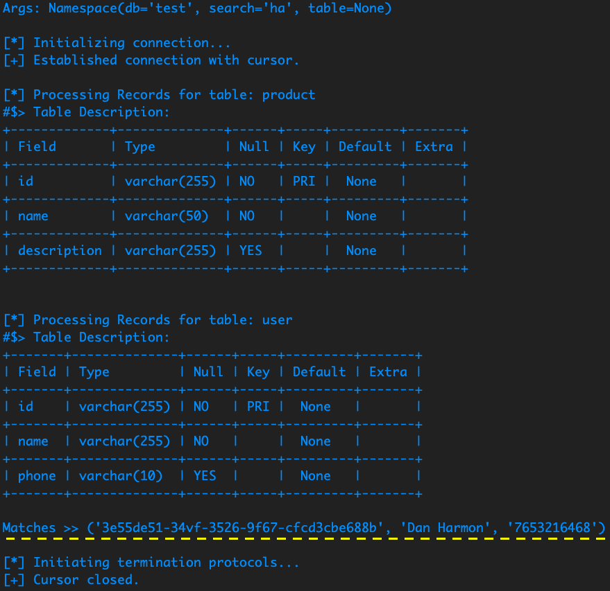

# GrepQL

A command-line utility to grep through SQL. i.e.: grepql  --db=people --search=terminator


-----


## Usage

```bash

export MySQL_USER=root
export MySQL_SECRET=password

python grepql.py --db=product --search=ha

```



-----


## TODO

- Make a pip package
- Expand to each our own

